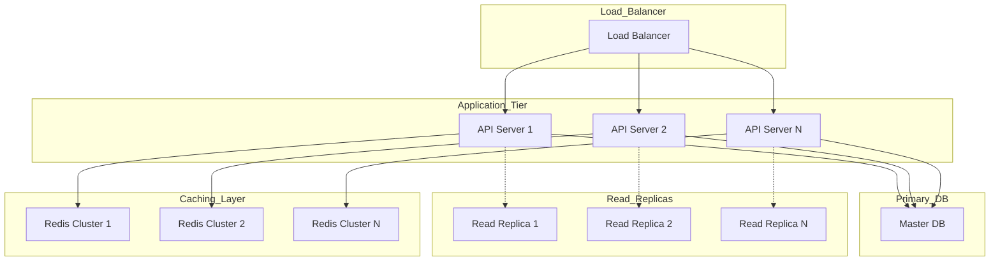

# Learning Experience Platform - Backend Implementation

## 1. Infrastructure Architecture

### 1.1 Database Scaling Strategy


### 1.2 Service Architecture
```typescript
// Core service interfaces
interface IBaseService<T> {
  findById(id: string): Promise<T>
  findMany(args: FindManyArgs): Promise<T[]>
  create(data: CreateInput<T>): Promise<T>
  update(id: string, data: UpdateInput<T>): Promise<T>
  delete(id: string): Promise<void>
}

interface ICacheService {
  get<T>(key: string): Promise<T | null>
  set<T>(key: string, value: T, ttl?: number): Promise<void>
  delete(key: string): Promise<void>
  invalidatePattern(pattern: string): Promise<void>
}

interface IQueueService {
  enqueue(job: Job): Promise<void>
  process(handler: JobHandler): void
  getStatus(jobId: string): Promise<JobStatus>
}
```

## 2. Core Services Implementation

### 2.1 Database Service Layer
```typescript
// src/services/database/base.service.ts
export abstract class BaseService<T> {
  constructor(
    protected readonly prisma: PrismaClient,
    protected readonly cache: ICacheService,
    protected readonly logger: ILogger
  ) {}

  protected abstract get model(): PrismaModel
  protected abstract get cachePrefix(): string

  async findById(id: string): Promise<T | null> {
    const cacheKey = \`\${this.cachePrefix}:\${id}\`
    const cached = await this.cache.get<T>(cacheKey)
    
    if (cached) {
      return cached
    }

    const result = await this.prisma[this.model].findUnique({
      where: { id }
    })

    if (result) {
      await this.cache.set(cacheKey, result, 300) // 5 minutes TTL
    }

    return result
  }

  async findMany(args: FindManyArgs): Promise<PaginatedResult<T>> {
    const { page = 1, limit = 50, ...queryArgs } = args
    const skip = (page - 1) * limit

    const [total, items] = await Promise.all([
      this.prisma[this.model].count(queryArgs),
      this.prisma[this.model].findMany({
        ...queryArgs,
        skip,
        take: limit,
      })
    ])

    return {
      items,
      total,
      page,
      limit,
      totalPages: Math.ceil(total / limit)
    }
  }

  async create(data: CreateInput<T>): Promise<T> {
    const result = await this.prisma[this.model].create({
      data
    })

    await this.invalidateListCache()
    return result
  }

  protected async invalidateListCache(): Promise<void> {
    await this.cache.invalidatePattern(\`\${this.cachePrefix}:list:*\`)
  }
}
```

### 2.2 Caching Strategy
```typescript
// src/services/cache/redis.service.ts
export class RedisService implements ICacheService {
  private readonly client: Redis.Cluster

  constructor(
    private readonly config: RedisConfig,
    private readonly logger: ILogger
  ) {
    this.client = new Redis.Cluster(config.nodes)
  }

  async get<T>(key: string): Promise<T | null> {
    try {
      const value = await this.client.get(key)
      return value ? JSON.parse(value) : null
    } catch (error) {
      this.logger.error('Redis get error', { key, error })
      return null
    }
  }

  async set<T>(
    key: string, 
    value: T, 
    ttl?: number
  ): Promise<void> {
    try {
      const serialized = JSON.stringify(value)
      if (ttl) {
        await this.client.setex(key, ttl, serialized)
      } else {
        await this.client.set(key, serialized)
      }
    } catch (error) {
      this.logger.error('Redis set error', { key, error })
    }
  }

  async invalidatePattern(pattern: string): Promise<void> {
    try {
      const keys = await this.client.keys(pattern)
      if (keys.length > 0) {
        await this.client.del(keys)
      }
    } catch (error) {
      this.logger.error('Redis invalidate error', { pattern, error })
    }
  }
}
```

### 2.3 Queue Management
```typescript
// src/services/queue/bull.service.ts
export class BullQueueService implements IQueueService {
  private readonly queues: Map<string, Queue>

  constructor(
    private readonly config: QueueConfig,
    private readonly logger: ILogger
  ) {
    this.queues = new Map()
  }

  async enqueue(job: Job): Promise<void> {
    const queue = this.getQueue(job.type)
    await queue.add(job.data, {
      priority: job.priority,
      attempts: job.retries,
      backoff: {
        type: 'exponential',
        delay: 1000
      }
    })
  }

  async process(
    jobType: string,
    handler: JobHandler
  ): void {
    const queue = this.getQueue(jobType)
    queue.process(async (job) => {
      try {
        await handler(job.data)
      } catch (error) {
        this.logger.error('Job processing error', {
          jobId: job.id,
          type: jobType,
          error
        })
        throw error
      }
    })
  }

  private getQueue(type: string): Queue {
    if (!this.queues.has(type)) {
      this.queues.set(
        type,
        new Queue(type, {
          redis: this.config.redis,
          defaultJobOptions: {
            removeOnComplete: true,
            removeOnFail: false
          }
        })
      )
    }
    return this.queues.get(type)!
  }
}
```

## 3. Domain Services Implementation

### 3.1 Academic Service
```typescript
// src/services/academic/program.service.ts
export class ProgramService extends BaseService<Program> {
  protected get model() { return 'program' }
  protected get cachePrefix() { return 'program' }

  async createProgram(
    data: CreateProgramInput,
    institutionId: string
  ): Promise<Program> {
    const program = await this.prisma.$transaction(async (tx) => {
      // Create program
      const program = await tx.program.create({
        data: {
          ...data,
          institutionId,
          curriculum: {
            create: this.generateCurriculum(data.curriculumTemplate)
          }
        }
      })

      // Create term structure
      await tx.termSystem.create({
        data: {
          programId: program.id,
          type: data.termSystem,
          termsPerYear: data.termsPerYear,
          weeksPerTerm: data.weeksPerTerm
        }
      })

      return program
    })

    await this.queueService.enqueue({
      type: 'PROGRAM_CREATED',
      data: { programId: program.id }
    })

    return program
  }

  async getProgramStats(
    programId: string
  ): Promise<ProgramStats> {
    const cacheKey = \`program:stats:\${programId}\`
    const cached = await this.cache.get<ProgramStats>(cacheKey)

    if (cached) {
      return cached
    }

    const [
      studentCount,
      courseCount,
      activeClasses,
      completionRate
    ] = await Promise.all([
      this.getStudentCount(programId),
      this.getCourseCount(programId),
      this.getActiveClassCount(programId),
      this.calculateCompletionRate(programId)
    ])

    const stats = {
      studentCount,
      courseCount,
      activeClasses,
      completionRate
    }

    await this.cache.set(cacheKey, stats, 300) // 5 minutes TTL
    return stats
  }
}
```

### 3.2 Enrollment Service
```typescript
// src/services/enrollment/enrollment.service.ts
export class EnrollmentService extends BaseService<Enrollment> {
  protected get model() { return 'enrollment' }
  protected get cachePrefix() { return 'enrollment' }

  async enrollStudent(
    data: EnrollStudentInput
  ): Promise<Enrollment> {
    // Check class capacity
    await this.validateClassCapacity(data.classId)

    const enrollment = await this.prisma.$transaction(async (tx) => {
      // Create enrollment
      const enrollment = await tx.enrollment.create({
        data: {
          studentId: data.studentId,
          classId: data.classId,
          status: 'ACTIVE'
        }
      })

      // Create initial progress records
      await tx.progressTracking.createMany({
        data: data.subjects.map(subjectId => ({
          studentId: data.studentId,
          subjectId,
          progress: {}
        }))
      })

      return enrollment
    })

    // Notify relevant parties
    await this.queueService.enqueue({
      type: 'STUDENT_ENROLLED',
      data: {
        enrollmentId: enrollment.id,
        studentId: data.studentId,
        classId: data.classId
      }
    })

    return enrollment
  }

  private async validateClassCapacity(
    classId: string
  ): Promise<void> {
    const [classDetails, currentCount] = await Promise.all([
      this.prisma.class.findUnique({
        where: { id: classId },
        select: { capacity: true }
      }),
      this.prisma.enrollment.count({
        where: {
          classId,
          status: 'ACTIVE'
        }
      })
    ])

    if (!classDetails) {
      throw new Error('Class not found')
    }

    if (currentCount >= classDetails.capacity) {
      throw new Error('Class capacity reached')
    }
  }
}
```

### 3.3 Assessment Service
```typescript
// src/services/assessment/assessment.service.ts
export class AssessmentService extends BaseService<Assessment> {
  protected get model() { return 'assessment' }
  protected get cachePrefix() { return 'assessment' }

  async createAssessment(
    data: CreateAssessmentInput
  ): Promise<Assessment> {
    const assessment = await this.prisma.assessment.create({
      data: {
        ...data,
        status: 'DRAFT'
      }
    })

    // Generate assessment materials
    await this.queueService.enqueue({
      type: 'GENERATE_ASSESSMENT_MATERIALS',
      data: {
        assessmentId: assessment.id,
        template: data.template
      }
    })

    return assessment
  }

  async submitAssessment(
    data: SubmitAssessmentInput
  ): Promise<AssessmentSubmission> {
    const submission = await this.prisma.$transaction(async (tx) => {
      // Create submission
      const submission = await tx.assessmentSubmission.create({
        data: {
          assessmentId: data.assessmentId,
          studentId: data.studentId,
          answers: data.answers
        }
      })

      // Update student progress
      await tx.progressTracking.update({
        where: {
          studentId_subjectId: {
            studentId: data.studentId,
            subjectId: data.subjectId
          }
        },
        data: {
          progress: {
            update: {
              assessmentsCompleted: {
                increment: 1
              }
            }
          }
        }
      })

      return submission
    })

    // Queue for grading if automated
    if (data.gradingType === 'AUTOMATED') {
      await this.queueService.enqueue({
        type: 'GRADE_ASSESSMENT',
        data: {
          submissionId: submission.id
        }
      })
    }

    return submission
  }
}
```

## 4. Background Processing

### 4.1 Job Processors
```typescript
// src/processors/assessment.processor.ts
export class AssessmentProcessor {
  constructor(
    private readonly queueService: IQueueService,
    private readonly assessmentService: AssessmentService,
    private readonly notificationService: NotificationService,
    private readonly logger: ILogger
  ) {
    this.initializeProcessors()
  }

  private initializeProcessors(): void {
    this.queueService.process(
      'GRADE_ASSESSMENT',
      this.handleGradeAssessment.bind(this)
    )
  }

  private async handleGradeAssessment(
    data: GradeAssessmentJob
  ): Promise<void> {
    try {
      const submission = await this.assessmentService
        .getSubmission(data.submissionId)

      const grade = await this.assessmentService
        .calculateGrade(submission)

      await this.assessmentService
        .updateSubmissionGrade(data.submissionId, grade)

      await this.notificationService.notify({
        type: 'ASSESSMENT_GRADED',
        userId: submission.studentId,
        data: {
          assessmentId: submission.assessmentId,
          grade
        }
      })
    } catch (error) {
      this.logger.error('Assessment grading failed', {
        submissionId: data.submissionId,
        error
      })
      throw error
    }
  }
}
```

### 4.2 Scheduled Tasks
```typescript
// src/tasks/academic.tasks.ts
export class AcademicTasks {
  constructor(
    private readonly scheduler: IScheduler,
    private readonly academicService: AcademicService,
    private readonly logger: ILogger
  ) {
    this.initializeTasks()
  }

  private initializeTasks(): void {
    // Daily tasks
    this.scheduler.schedule('0 0 * * *', this.updateAttendanceStats.bind(this))
    
    // Weekly tasks
    this.scheduler.schedule('0 0 * * 0', this.generateWeeklyReports.bind(this))
    
    // Monthly tasks
    this.scheduler.schedule('0 0 1 * *', this.calculateMonthlyMetrics.bind(this))
  }

  private async updateAttendanceStats(): Promise<void> {
    try {
      const classes = await this.academicService.getActiveClasses()
      
      for (const classId of classes) {
        await this.queueService.enqueue({
          type: 'UPDATE_CLASS_ATTENDANCE',
          data: { classId }
        })
      }
    } catch (error) {
      this.logger.error('Attendance stats update failed', { error })
    }
  }
}
```

## 5. API Implementation

### 5.1 TRPC Routers
```typescript
// src/server/trpc/routers/academic.ts
export const academicRouter = createTRPCRouter({
  createProgram: protectedProcedure
    .input(createProgramSchema)
    .mutation(async ({ ctx, input }) => {
      const service = new ProgramService(ctx.prisma, ctx.cache, ctx.logger)
      return service.createProgram(input, ctx.user.institutionId)
    }),

  getProgramStats: protectedProcedure
    .input(z.object({ programId: z.string() }))
    .query(async ({ ctx, input }) => {
      const service = new ProgramService(ctx.prisma, ctx.cache, ctx.logger)
      return service.getProgramStats(input.programId)
    }),

  enrollStudent: protectedProcedure
    .input(enrollStudentSchema)
    .mutation(async ({ ctx, input }) => {
      const service = new EnrollmentService(ctx.prisma, ctx.cache, ctx.logger)
      return service.enrollStudent(input)
    })
})
```

### 5.2 API Middleware
```typescript
// src/server/trpc/middleware/performance.ts
export const withPerformance = t.middleware(async ({ path, next }) => {
  const start = performance.now()
  const result = await next()
  const duration = performance.now() - start

  // Log performance metrics
  await prisma.endpointMetrics.upsert({
    where: { path },
    update: {
      totalRequests: { increment: 1 },
      averageResponseTime: {
        set: (currentAvg * totalRequests + duration) / (totalRequests + 1)
      }
    },
    create: {
      path,
      totalRequests: 1,
      averageResponseTime: duration
    }
  })

  return result
})

// src/server/trpc/middleware/rateLimit.ts
export const withRateLimit = t.middleware(async ({ ctx, next }) => {
  const key = \`rate-limit:\${ctx.user.id}\`
  const limit = 1000 // requests per minute
  const current = await ctx.redis.incr(key)
  
  if (current === 1) {
    await ctx.redis.expire(key, 60)
  }
  
  if (current > limit) {
    throw new TRPCError({
      code: 'TOO_MANY_REQUESTS',
      message: 'Rate limit exceeded'
    })
  }
  
  return next()
})
```

## 6. Performance Optimization

### 6.1 Query Optimization
```typescript
// src/lib/db/query-builder.ts
export class QueryBuilder<T> {
  constructor(
    private readonly model: PrismaModel,
    private readonly prisma: PrismaClient
  ) {}

  async paginate(
    args: PaginationArgs,
    where: WhereInput = {}
  ): Promise<PaginatedResult<T>> {
    const { page = 1, limit = 50, sortBy, sortOrder = 'desc' } = args
    const skip = (page - 1) * limit

    const [total, items] = await Promise.all([
      this.prisma[this.model].count({ where }),
      this.prisma[this.model].findMany({
        where,
        skip,
        take: limit,
        orderBy: sortBy ? { [sortBy]: sortOrder } : undefined,
        ...this.getOptimizedSelect(args.select)
      })
    ])

    return {
      items,
      total,
      page,
      limit,
      totalPages: Math.ceil(total / limit)
    }
  }

  private getOptimizedSelect(select?: string[]): object {
    if (!select?.length) return {}

    return {
      select: select.reduce((acc, field) => ({
        ...acc,
        [field]: true
      }), {})
    }
  }
}
```

### 6.2 Caching Strategy
```typescript
// src/lib/cache/strategies.ts
export class CacheStrategy {
  static readonly CACHE_CONFIGS = {
    PROGRAM: {
      ttl: 300, // 5 minutes
      patterns: ['program:*', 'program:list:*']
    },
    CLASS: {
      ttl: 180, // 3 minutes
      patterns: ['class:*', 'class:list:*']
    },
    STUDENT: {
      ttl: 600, // 10 minutes
      patterns: ['student:*', 'student:list:*']
    }
  }

  static getConfig(type: keyof typeof CacheStrategy.CACHE_CONFIGS) {
    return CacheStrategy.CACHE_CONFIGS[type]
  }

  static async withCache<T>(
    cache: ICacheService,
    key: string,
    ttl: number,
    fetchFn: () => Promise<T>
  ): Promise<T> {
    const cached = await cache.get<T>(key)
    if (cached) return cached

    const fresh = await fetchFn()
    await cache.set(key, fresh, ttl)
    return fresh
  }
}
```

## 7. Monitoring and Logging

### 7.1 Logging Implementation
```typescript
// src/lib/logging/logger.ts
export class Logger implements ILogger {
  constructor(
    private readonly service: string,
    private readonly transport: LogTransport
  ) {}

  async log(
    level: LogLevel,
    message: string,
    meta?: Record<string, any>
  ): Promise<void> {
    const entry = {
      timestamp: new Date().toISOString(),
      service: this.service,
      level,
      message,
      ...meta
    }

    await this.transport.send(entry)
  }

  error(message: string, meta?: Record<string, any>): Promise<void> {
    return this.log('error', message, meta)
  }

  warn(message: string, meta?: Record<string, any>): Promise<void> {
    return this.log('warn', message, meta)
  }

  info(message: string, meta?: Record<string, any>): Promise<void> {
    return this.log('info', message, meta)
  }
}
```

### 7.2 Metrics Collection
```typescript
// src/lib/metrics/collector.ts
export class MetricsCollector {
  constructor(
    private readonly client: PrometheusClient,
    private readonly prefix: string = 'lxp_'
  ) {
    this.initializeMetrics()
  }

  private initializeMetrics(): void {
    this.requestCounter = new this.client.Counter({
      name: \`\${this.prefix}requests_total\`,
      help: 'Total number of requests',
      labelNames: ['path', 'method', 'status']
    })

    this.responseTime = new this.client.Histogram({
      name: \`\${this.prefix}response_time_seconds\`,
      help: 'Response time in seconds',
      labelNames: ['path'],
      buckets: [0.1, 0.5, 1, 2, 5]
    })

    this.activeUsers = new this.client.Gauge({
      name: \`\${this.prefix}active_users\`,
      help: 'Number of currently active users'
    })
  }

  recordRequest(
    path: string,
    method: string,
    status: number
  ): void {
    this.requestCounter.labels(path, method, status).inc()
  }

  recordResponseTime(
    path: string,
    duration: number
  ): void {
    this.responseTime.labels(path).observe(duration)
  }

  setActiveUsers(count: number): void {
    this.activeUsers.set(count)
  }
}
```

## 8. Scaling Considerations

### 8.1 Database Sharding
```typescript
// src/lib/db/sharding.ts
export class ShardManager {
  constructor(
    private readonly config: ShardConfig,
    private readonly logger: ILogger
  ) {}

  getShardId(institutionId: string): string {
    const shardCount = this.config.shards.length
    const hash = this.hashString(institutionId)
    return \`shard_\${hash % shardCount}\`
  }

  async getConnection(shardId: string): Promise<PrismaClient> {
    const config = this.config.shards.find(s => s.id === shardId)
    if (!config) {
      throw new Error(\`Shard \${shardId} not found\`)
    }

    return new PrismaClient({
      datasources: {
        db: {
          url: config.url
        }
      }
    })
  }

  private hashString(str: string): number {
    let hash = 0
    for (let i = 0; i < str.length; i++) {
      const char = str.charCodeAt(i)
      hash = ((hash << 5) - hash) + char
      hash = hash & hash
    }
    return Math.abs(hash)
  }
}
```

### 8.2 Load Balancing
```typescript
// src/lib/loadbalancing/strategy.ts
export class LoadBalancer {
  private readonly nodes: ServiceNode[]
  private currentIndex: number = 0

  constructor(nodes: ServiceNode[]) {
    this.nodes = nodes
  }

  getNext(): ServiceNode {
    const node = this.nodes[this.currentIndex]
    this.currentIndex = (this.currentIndex + 1) % this.nodes.length
    return node
  }

  markNodeDown(nodeId: string): void {
    const node = this.nodes.find(n => n.id === nodeId)
    if (node) {
      node.status = 'DOWN'
      this.rebalance()
    }
  }

  private rebalance(): void {
    this.nodes.sort((a, b) => {
      if (a.status === 'UP' && b.status === 'DOWN') return -1
      if (a.status === 'DOWN' && b.status === 'UP') return 1
      return a.load - b.load
    })
  }
}
```

This backend implementation provides:

1. **Scalability**
   - Database sharding for handling large data volumes
   - Read replicas for query optimization
   - Redis clustering for distributed caching
   - Load balancing across multiple API servers

2. **Performance**
   - Optimized query building
   - Multi-level caching strategy
   - Background job processing
   - Rate limiting and request throttling

3. **Reliability**
   - Transaction management
   - Error handling and logging
   - Monitoring and metrics collection
   - Health checks and auto-recovery

4. **Maintainability**
   - Clean service architecture
   - Type-safe implementations
   - Comprehensive logging
   - Modular design

Would you like me to elaborate on any specific aspect of the implementation? 