# Learning Experience Platform - System Architecture

## 1. High-Level System Architecture

```mermaid
graph TB
    subgraph Core_Platform
        Institution[Institution Management]
        Academic[Academic Management]
        Learning[Learning Management]
        Assessment[Assessment System]
        User[User Management]
    end

    subgraph Infrastructure
        Auth[Authentication]
        DataStore[Data Storage]
        Cache[Caching Layer]
        Analytics[Analytics Engine]
    end

    subgraph Domain_Services
        Campus[Campus Management]
        Program[Program Management]
        Class[Class Management]
        Activity[Activity Management]
        Attendance[Attendance System]
    end

    Institution --> Program
    Program --> Class
    Class --> Activity
    Class --> Attendance
    Learning --> Activity
    Assessment --> Activity
    User --> Auth
    
    Campus --> Class
    Program --> Academic
    Academic --> Assessment

## 2. Core Domain Models

### 2.1 Institution Hierarchy
```mermaid
erDiagram
    Institution ||--o{ Campus : has
    Institution ||--o{ Program : offers
    Campus ||--o{ CampusProgram : implements
    Program ||--o{ Course : contains
    Course ||--o{ Subject : includes
    CampusProgram ||--o{ Class : manages
```

### 2.2 Learning Management
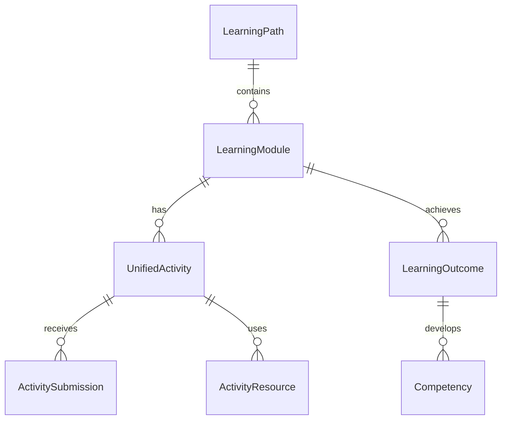

### 2.3 Assessment System
```mermaid
erDiagram
    Class ||--|| GradeBook : has
    GradeBook ||--o{ StudentGrade : contains
    UnifiedActivity ||--o{ ActivitySubmission : assesses
    ActivitySubmission ||--|| ActivityGrade : receives
    AssessmentPeriod ||--o{ Assessment : schedules
```

### 2.4 Attendance System
```mermaid
erDiagram
    Class ||--o{ AttendanceSession : schedules
    AttendanceSession ||--o{ AttendanceRecord : tracks
    AttendanceRecord }|--|| User : belongs_to
```

### 2.5 User Profile and Role Management
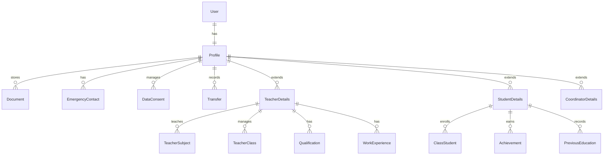

### 2.6 Academic Structure
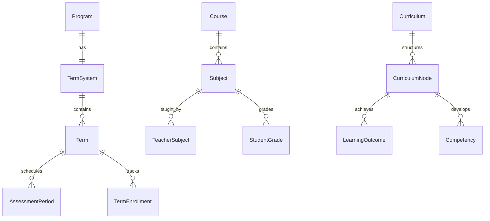

## 3. Data Flow Architecture

### 3.1 User Interaction Flow
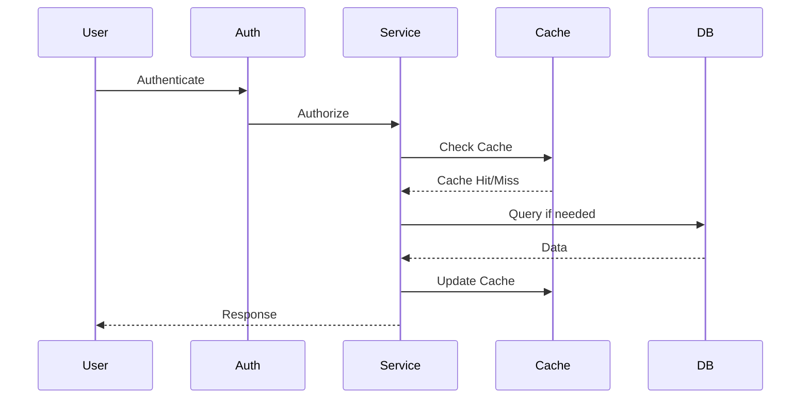

### 3.2 Activity Flow
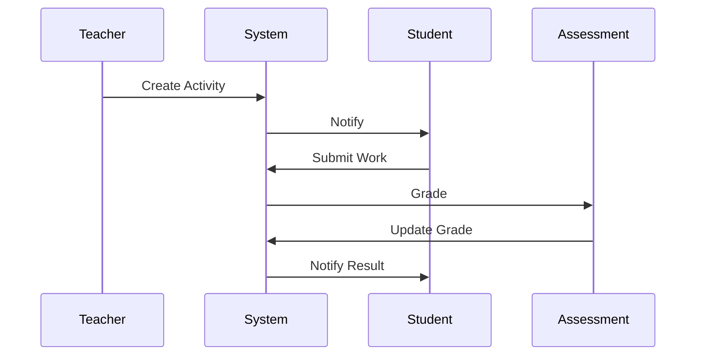

## 4. Key Components

### 4.1 Core Services
- **Institution Management**
  - Institution configuration
  - Campus management
  - Program administration

- **Academic Management**
  - Course management
  - Curriculum planning
  - Term system management

- **Learning Management**
  - Learning path creation
  - Module management
  - Activity coordination
  - Resource management

- **Assessment System**
  - Grading management
  - Performance tracking
  - Competency assessment

### 4.2 Support Services
- **User Management**
  - Profile management
  - Role-based access control
  - User authentication

- **Data Management**
  - Data partitioning
  - Sharding configuration
  - Caching strategies

## 5. Database Design

### 5.1 Optimization Strategies
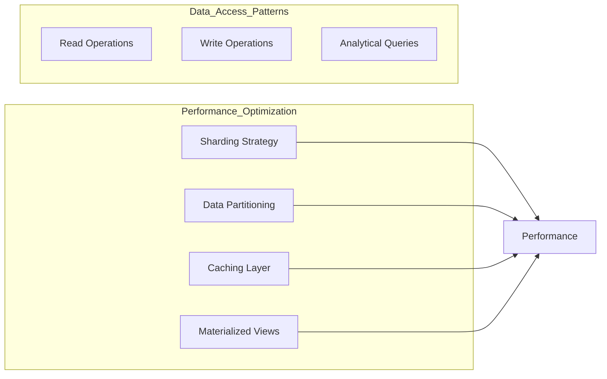

### 5.2 Data Access Patterns
- **Frequent Read Operations**
  - Class summaries
  - Student profiles
  - Activity status

### 5.3 Data Optimization Models
```mermaid
erDiagram
    DataView ||--o{ QueryOptimization : uses
    ClassSummary ||--|| Class : summarizes
    StudentSummary ||--|| StudentDetails : summarizes
    
    ShardConfig ||--o{ PartitionConfig : configures
    PartitionConfig ||--o{ DataView : optimizes
```

### 5.4 Analytics and Reporting
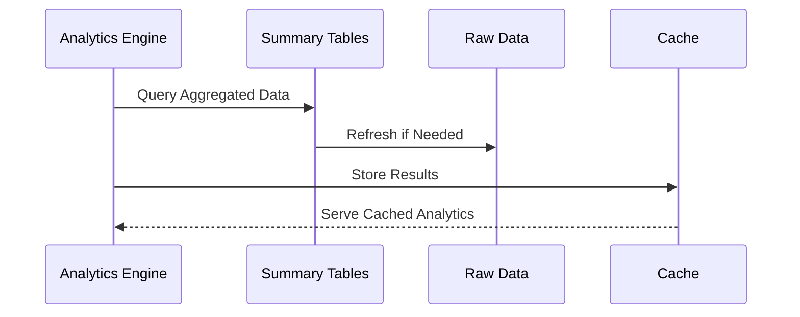

Key Analytics Models:
- **ClassSummary**
  - Student counts
  - Attendance rates
  - Performance metrics
  - Activity statistics

- **StudentSummary**
  - Enrollment status
  - Academic performance
  - Attendance patterns
  - Risk assessment

- **DataView**
  - Custom analytics views
  - Performance optimized queries
  - Role-based access control
  - Automated refresh cycles

## 6. Security Architecture

### 6.1 Authentication Flow
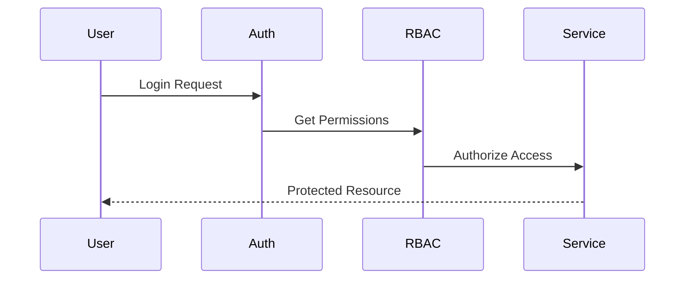

### 6.2 Data Protection
- Role-based access control
- Data encryption
- Audit logging
- GDPR compliance

### 6.3 GDPR and Data Protection
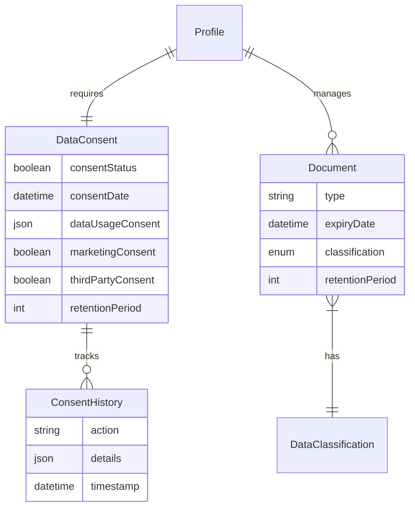

Key GDPR Features:
- **Consent Management**
  - Explicit user consent tracking
  - Granular consent options
  - Consent history and audit trail
  - Automated consent expiration

- **Data Retention**
  - Configurable retention periods
  - Automated data cleanup
  - Data classification
  - Document lifecycle management

- **Data Subject Rights**
  - Right to access
  - Right to be forgotten
  - Data portability
  - Consent withdrawal

## 7. Technical Implementation

### 7.1 tRPC and Prisma Integration
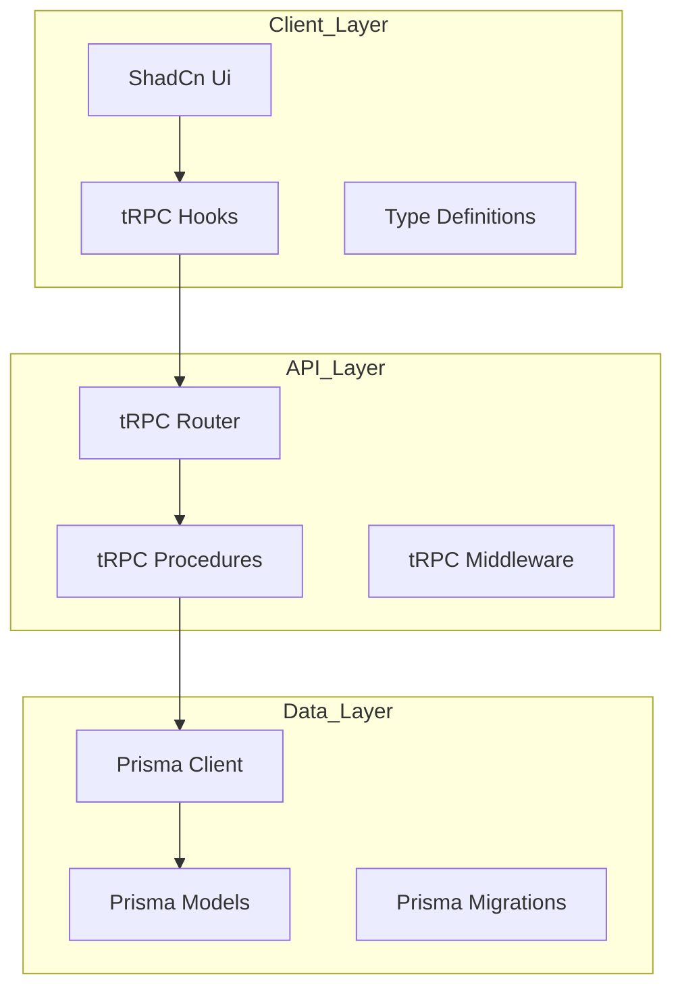

### 7.2 API Structure
```mermaid
graph LR
    subgraph tRPC_Routers
        direction TB
        InstitutionRouter[Institution Router]
        AcademicRouter[Academic Router]
        UserRouter[User Router]
        AttendanceRouter[Attendance Router]
        ActivityRouter[Activity Router]
    end

    subgraph Procedures
        direction TB
        Queries[Query Procedures]
        Mutations[Mutation Procedures]
        Subscriptions[Subscription Procedures]
    end

    subgraph Middleware
        Auth[Authentication]
        Validation[Input Validation]
        Caching[Response Caching]
        Logging[Request Logging]
    end

    tRPC_Routers --> Procedures
    Procedures --> Middleware
```

### 7.3 Type-Safe Data Flow
```typescript
// Example type-safe procedure
interface ExampleRouter {
  // Queries
  getInstitution: {
    input: { id: string };
    output: InstitutionWithRelations;
  };
  
  // Mutations
  createCourse: {
    input: CreateCourseInput;
    output: Course;
  };
  
  // Subscriptions
  onAttendanceUpdate: {
    input: { sessionId: string };
    output: AttendanceRecord;
  };
}

// Middleware example
const authMiddleware = t.middleware(async ({ ctx, next }) => {
  if (!ctx.session) {
    throw new TRPCError({ code: 'UNAUTHORIZED' });
  }
  return next({
    ctx: {
      ...ctx,
      user: ctx.session.user,
    },
  });
});

// Procedure example
const createActivityProcedure = protectedProcedure
  .input(createActivitySchema)
  .mutation(async ({ ctx, input }) => {
    return ctx.prisma.unifiedActivity.create({
      data: input,
      include: {
        module: true,
        submissions: true,
      },
    });
  });
```

### 7.4 Key Implementation Features

#### Prisma Integration
- **Model Definition**
  ```prisma
  // Example of type-safe model usage
  model UnifiedActivity {
    id          String   @id @default(cuid())
    title       String
    type        ActivityType
    moduleId    String
    module      LearningModule @relation(fields: [moduleId], references: [id])
    submissions ActivitySubmission[]
    // ... other fields
  }
  ```

- **Type-Safe Queries**
  ```typescript
  // Example of type-safe query
  const getActivityWithSubmissions = async (activityId: string) => {
    return prisma.unifiedActivity.findUnique({
      where: { id: activityId },
      include: {
        submissions: {
          include: {
            user: true,
            grades: true,
          },
        },
      },
    });
  };
  ```

#### tRPC Features
- **Type Safety**
  - End-to-end type safety
  - Automatic type inference
  - Shared types between client and server

- **Performance**
  - Automatic request batching
  - Response caching
  - Optimistic updates

- **Security**
  - Input validation
  - Authentication middleware
  - Role-based access control

#### Integration Patterns
- **Repository Pattern**
  ```typescript
  class ActivityRepository {
    constructor(private prisma: PrismaClient) {}

    async createActivity(data: CreateActivityInput) {
      return this.prisma.unifiedActivity.create({
        data,
        include: { /* relations */ },
      });
    }
  }
  ```

- **Service Layer**
  ```typescript
  class ActivityService {
    constructor(private repo: ActivityRepository) {}

    async createActivity(input: CreateActivityInput, userId: string) {
      // Business logic
      const activity = await this.repo.createActivity({
        ...input,
        createdById: userId,
      });
      
      // Additional operations
      await this.notificationService.notifyStudents(activity);
      return activity;
    }
  }
  ```

### 7.5 Data Access Optimization
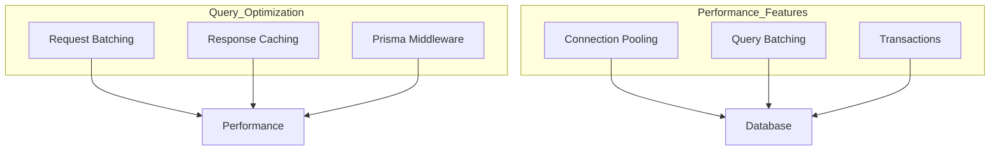

## 8. Vector Database and Knowledge Base Architecture

### 8.1 Vector Database Integration
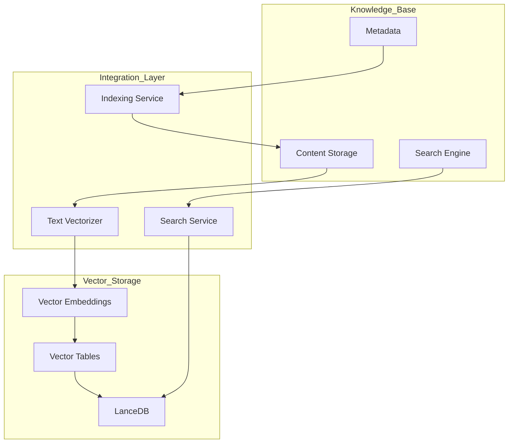

### 8.2 Knowledge Base Components
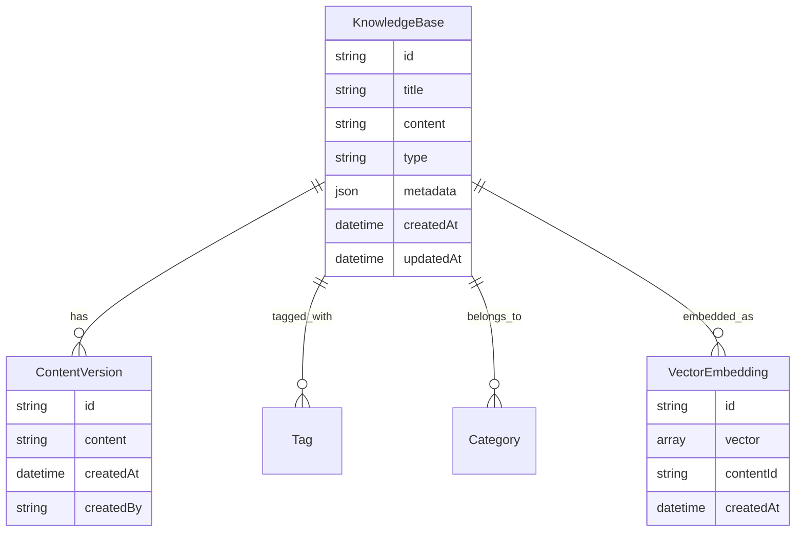

### 8.3 Search Flow Architecture
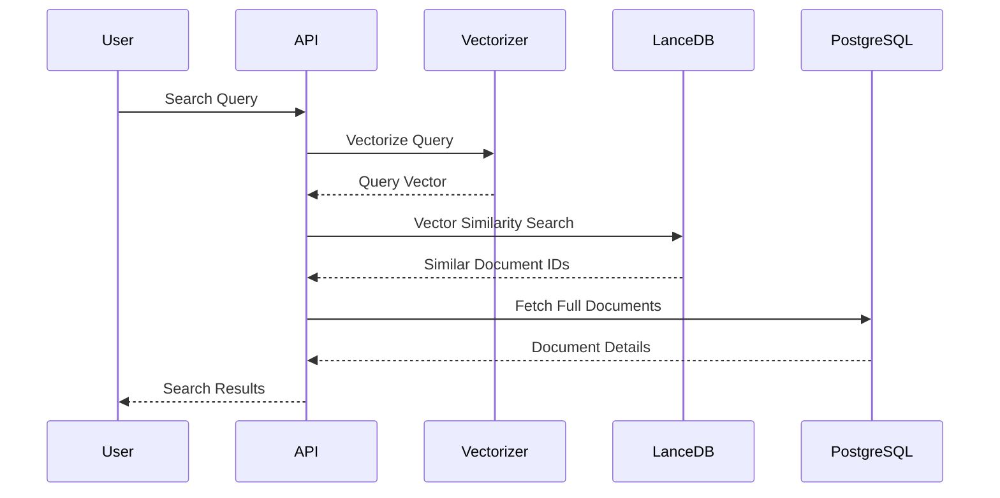

### 8.4 Content Indexing Flow
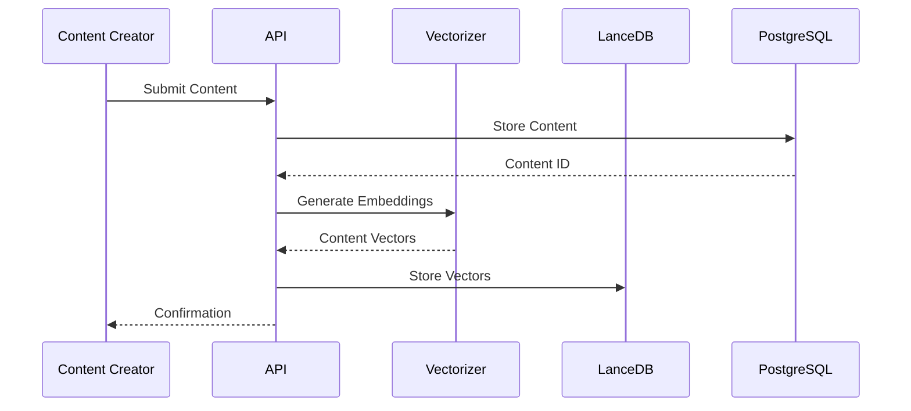

### 8.5 Knowledge Base Features

1. **Content Types**
   - Course Materials
   - Lesson Plans
   - Assessments
   - Resources
   - FAQs
   - Documentation

2. **Search Capabilities**
   - Semantic Search
   - Keyword Search
   - Category-based Search
   - Tag-based Filtering
   - Relevance Scoring

3. **Content Management**
   - Version Control
   - Metadata Management
   - Content Categorization
   - Access Control
   - Content Validation

4. **Integration Points**
   - Course Management
   - Learning Paths
   - Assessment System
   - Resource Library
   - User Dashboard

### 8.6 Performance Considerations

1. **Vector Storage Optimization**
   - Dimensionality Reduction
   - Clustering
   - Index Optimization
   - Batch Processing

2. **Search Performance**
   - Vector Caching
   - Result Caching
   - Query Optimization
   - Parallel Processing

3. **Content Delivery**
   - CDN Integration
   - Content Compression
   - Lazy Loading
   - Progressive Loading

4. **Scalability**
   - Horizontal Scaling
   - Sharding
   - Load Balancing
   - Replication

## 9. Scalability Considerations

### 9.1 Horizontal Scaling
```mermaid
graph TB
    subgraph Load_Balancer
        LB[Load Balancer]
    end

    subgraph Application_Tier
        App1[Instance 1]
        App2[Instance 2]
        App3[Instance N]
    end

    subgraph Database_Tier
        DB1[Shard 1]
        DB2[Shard 2]
        DB3[Shard N]
    end

    LB --> App1
    LB --> App2
    LB --> App3
    App1 --> DB1
    App2 --> DB2
    App3 --> DB3
```

### 9.2 Vertical Scaling
- Database optimization
- Cache optimization
- Query optimization

## 10. Integration Points

### 10.1 External Systems
```mermaid
graph LR
    LMS[Learning Platform]
    SMS[Student Management]
    CMS[Content Management]
    NMS[Notification System]

    LMS --- SMS
    LMS --- CMS
    LMS --- NMS
```

### 10.2 API Architecture
- TRPC APIs
- 
- Webhook integration
- Event-driven architecture

## 11. Monitoring and Analytics

### 11.1 System Monitoring
```mermaid
graph TB
    subgraph Monitoring
        Metrics[Metrics Collection]
        Logs[Log Aggregation]
        Alerts[Alert System]
    end

    subgraph Analytics
        Usage[Usage Analytics]
        Performance[Performance Analytics]
        Business[Business Intelligence]
    end

    Monitoring --> Analytics
```

### 11.2 Key Metrics
- System performance
- User engagement
- Learning outcomes
- Resource utilization

## 12. Deployment Architecture

### 12.1 Infrastructure
```mermaid
graph TB
    subgraph Cloud_Infrastructure
        LB[Load Balancer]
        App[Application Servers]
        Cache[Cache Servers]
        DB[Database Clusters]
    end

    subgraph Services
        Web[Web Services]
        API[API Services]
        Worker[Background Workers]
    end

    LB --> App
    App --> Cache
    App --> DB
    App --> Services
```

### 12.2 Deployment Strategy
- Continuous Integration/Deployment
- Blue-Green deployment
- Canary releases
- Rolling updates 