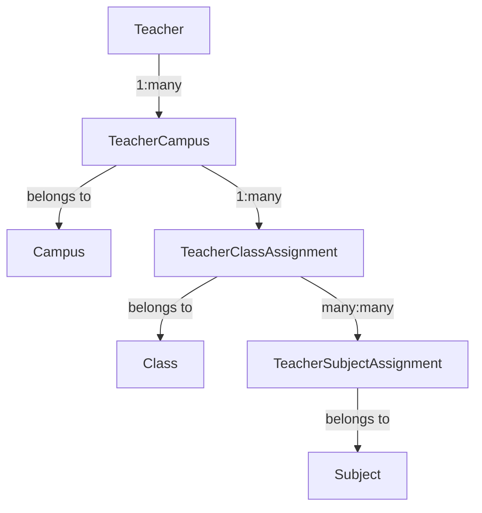

Let me break down the Campus-Centric flow implementation in detail.

**1. Database Schema Changes**



**Required Schema Changes:**
```prisma
// Existing models with modifications
model Teacher {
  id            String          @id @default(cuid())
  name          String
  email         String         @unique
  phoneNumber   String?
  teacherType   TeacherType
  specialization String?
  campusAssignments TeacherCampus[]
  // Remove direct class and subject relations
}

// New models
model TeacherCampus {
  id            String   @id @default(cuid())
  teacherId     String
  campusId      String
  isPrimary     Boolean  @default(false)
  teacher       Teacher  @relation(fields: [teacherId], references: [id])
  campus        Campus   @relation(fields: [campusId], references: [id])
  classAssignments TeacherClassAssignment[]
  
  @@unique([teacherId, campusId])
}

model TeacherClassAssignment {
  id              String   @id @default(cuid())
  teacherCampusId String
  classId         String
  teacherCampus   TeacherCampus @relation(fields: [teacherCampusId], references: [id])
  class           Class    @relation(fields: [classId], references: [id])
  subjectAssignments TeacherSubjectAssignment[]
}

model TeacherSubjectAssignment {
  id                    String   @id @default(cuid())
  teacherClassAssignmentId String
  subjectId             String
  teacherClassAssignment TeacherClassAssignment @relation(fields: [teacherClassAssignmentId], references: [id])
  subject               Subject  @relation(fields: [subjectId], references: [id])
}
```

**2. API Changes**

```typescript
// New/Modified API Endpoints needed:
interface ApiChanges {
  teacher: {
    // Modified endpoints
    createTeacher: (data: TeacherCreateInput) => Promise<Teacher>
    updateTeacher: (data: TeacherUpdateInput) => Promise<Teacher>
    
    // New endpoints
    assignToCampus: (teacherId: string, campusId: string, isPrimary: boolean) => Promise<TeacherCampus>
    assignToClass: (teacherCampusId: string, classId: string) => Promise<TeacherClassAssignment>
    assignSubjects: (teacherClassAssignmentId: string, subjectIds: string[]) => Promise<TeacherSubjectAssignment[]>
    
    // New query endpoints
    getTeacherCampusAssignments: (teacherId: string) => Promise<TeacherCampus[]>
    getTeacherClassAssignments: (teacherCampusId: string) => Promise<TeacherClassAssignment[]>
    getTeacherSubjectAssignments: (teacherClassAssignmentId: string) => Promise<TeacherSubjectAssignment[]>
  }
}
```

**3. UI Component Changes**

```typescript:src/components/dashboard/roles/super-admin/teacher/TeacherForm.tsx
// Major form restructuring needed:
interface FormChanges {
  // Step 1: Basic Info
  basicInfo: {
    name: string
    email: string
    phoneNumber: string
    teacherType: TeacherType
    specialization?: string
  }

  // Step 2: Campus Assignment
  campusAssignment: {
    campusId: string
    isPrimary: boolean
  }

  // Step 3: Class & Subject Assignment (per campus)
  classAssignments: {
    campusId: string
    classes: {
      classId: string
      subjects: string[] // subject IDs
    }[]
  }[]
}
```

**4. Impact Analysis**

1. **Database Impact**
   - Migration required for schema changes
   - Data migration needed for existing teacher assignments
   - Estimated downtime: 15-30 minutes for migration
   - Backup strategy needed before migration

2. **API Impact**
   - New endpoints needed (~8-10 new endpoints)
   - Existing endpoints need modification
   - API version management recommended
   - Estimated development time: 3-4 days

3. **UI Impact**
   - Major form restructuring required
   - New multi-step assignment process
   - Enhanced validation logic needed
   - Estimated development time: 4-5 days

4. **Business Logic Impact**
   - Simplified assignment hierarchy
   - Better data consistency
   - Improved query performance
   - Easier maintenance and scalability

5. **User Experience Impact**
   - More structured assignment process
   - Clearer relationship between campuses, classes, and subjects
   - Potentially more steps in the assignment process
   - Better error handling and validation

**5. Implementation Plan**

1. **Phase 1: Database Migration (1-2 days)**
   - Create new schema
   - Prepare migration scripts
   - Test data migration
   - Backup strategy

2. **Phase 2: API Development (3-4 days)**
   - Implement new endpoints
   - Modify existing endpoints
   - Add validation logic
   - Write tests

3. **Phase 3: UI Development (4-5 days)**
   - Restructure TeacherForm component
   - Implement multi-step assignment
   - Add validation
   - Update state management

4. **Phase 4: Testing (2-3 days)**
   - Unit testing
   - Integration testing
   - Migration testing
   - User acceptance testing

**6. Risks and Mitigation**

1. **Data Migration Risks**
   - Backup all existing data
   - Run migration in staging first
   - Prepare rollback plan
   - Schedule during low-traffic period

2. **Performance Risks**
   - Index key columns
   - Optimize queries
   - Implement caching where appropriate
   - Monitor query performance

3. **User Adoption Risks**
   - Provide clear documentation
   - Add tooltips and help text
   - Consider gradual rollout
   - Gather user feedback

**Total Estimated Timeline: 10-14 days**

Would you like me to elaborate on any specific aspect of this implementation plan?
